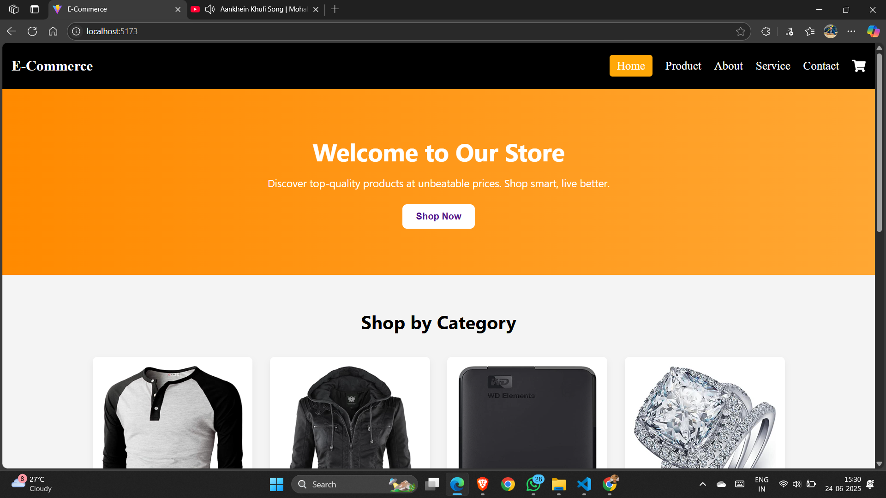
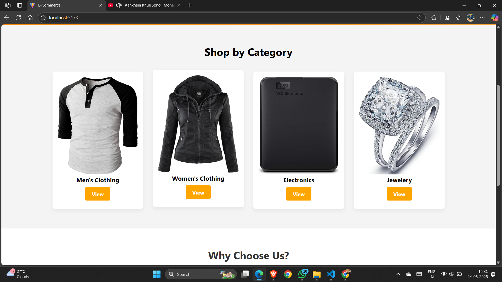
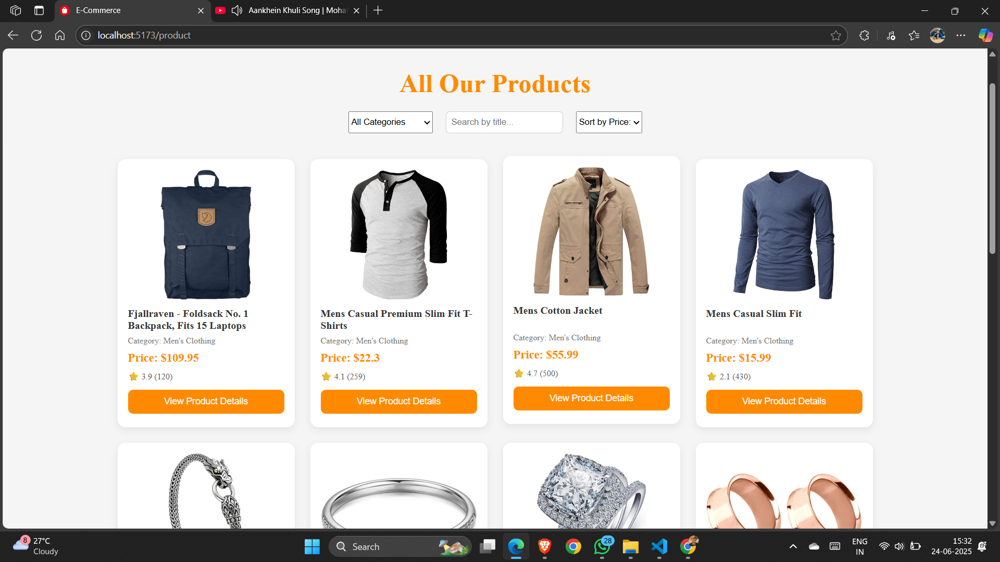

# 🛍️ E-Commerce Web App

An elegant and functional **e-commerce web application** built using **React.js** and **Core CSS**. It features a category-based browsing experience, product details, and cart functionalities. This project demonstrates modern frontend practices like routing, API data handling, and component-based architecture.

---

## 🚀 Features

- 🛒 Product Listing by Category (Men, Women, Electronics, Jewelry)
- 📦 View Detailed Product Information
- ➕ Add to Cart / ➖ Remove from Cart
- 🔄 Quantity Management
- 🔗 Client-side Routing with React Router
- 🌐 Data from JSON Server (local or hosted)
- ⚛️ Axios for API Requests

> ⚠️ *Note: This version is desktop-optimized and not yet responsive.*

---

## 🛠️ Tech Stack

| Technology      | Description                     |
|-----------------|---------------------------------|
| React.js        | Frontend UI Framework           |
| Core CSS        | Custom Styling                  |
| Axios           | HTTP Requests                   |
| React Router    | Navigation & Routing            |
| JSON Server     | Mock Backend API (db.json)      |

---

## 🧩 Getting Started

### 1️⃣ Clone the Repository

```bash
git clone https://github.com/KFS-developer/E-Commerce_website.git
```

### 2️⃣ Install Dependencies

```bash
npm install
```

### 3️⃣ Start React App

```bash
npm run dev
```

---

## 🌄 Screenshots

| Home Page | Categories | Product Detail |
|-----------|------------|----------------|
|  |  | |

---

## 🌍 Live Demo

🖥️ Frontend: [Visit Live Site](https://e-commerce-website-gamma-green.vercel.app/))

📦 Backend (JSON Server): [View Live API](https://e-commerce-data-cbe9.onrender.com/)

> Explore the full shopping experience, including product browsing, category filtering, and cart features.

---

## 👤 Author

**Patel Ketul**  

---

## 📃 License

Licensed under the [MIT License](LICENSE)

> ⭐ If you liked this project, please consider starring it on GitHub!
